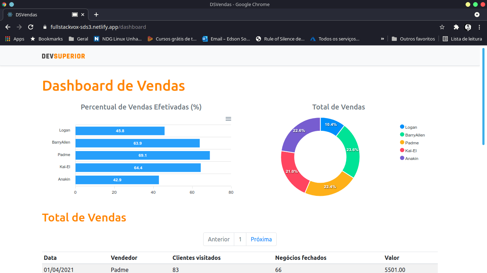

# DevSuperior: Semana Spring React

*Criando um app com as tecnologias mais demandadas do mercado*

# Projeto

Objetivo: Criação de app de dashboard de vendas com Frontend e Backend hospedados na nuvem.

# Tecnologias

## Backend

* Java 11
* Spring Boot
* JPA / Hibernate
* Maven
* Banco de Dados H2 (Ambiente de testes e desenvolvimento)
* Banco de Dados Postgres  (Ambiente de desenvolvimento e produção)

## Frontend

* ReactJS
* HTML5 / CSS3  / JS
* Typescript
* Bootstrap
* Apex Charts

# Produção

- Frontend: Netlify
- Backend: Heroku
- Banco de Dados: Postgres

## Instrutor(a)

Prof. Nélio Alves

## Entidade

Dev Superior  http:www.devsuperior.com

## Autor
Edson souza

[Linkedin](https://www.linkedin.com/in/edsonfrs/)

[GitHub](https://github.com/Edsonfrs)

